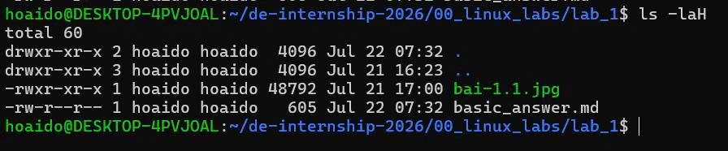
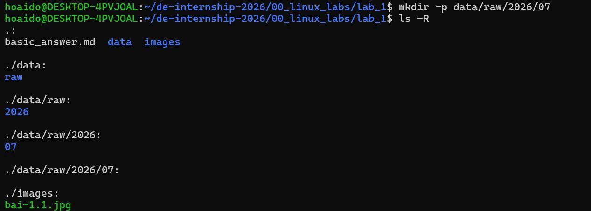
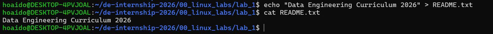
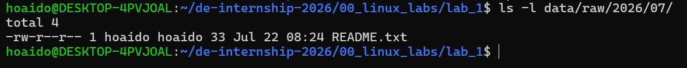
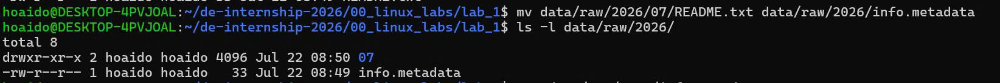
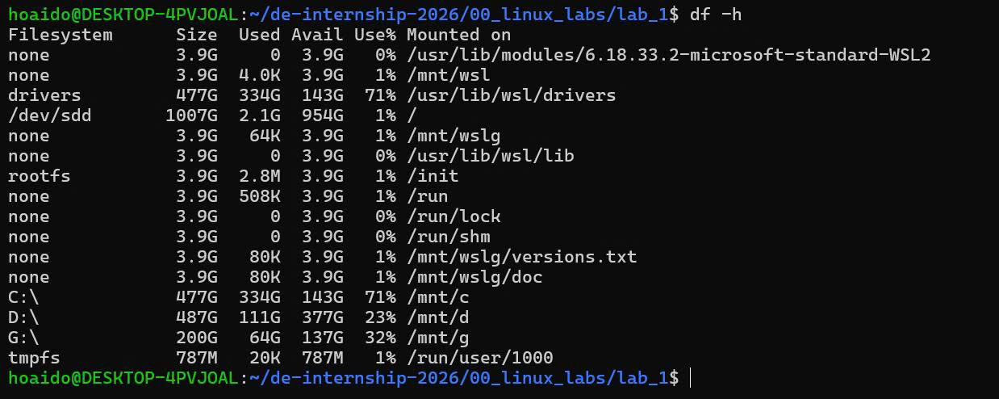

# LAB 1 - LINUX BASICS

## Bài 1.1

### Đề bài

Hiển thị đường dẫn đầy đủ của thư mục hiện tại bạn đang đứng.

### Lệnh thực thi

```bash
pwd
```

### Kết quả

```text
/home/hoaido/de-internship-2026/00_linux_labs/lab_1
```

### Ảnh minh chứng


---

## Bài 1.2

### Đề bài

Liệt kê toàn bộ các file trong thư mục hiện tại bao gồm cả các file ẩn (bắt đầu bằng dấu `.`) kèm theo kích thước định dạng dễ đọc như KB/MB.

### Lệnh thực thi

```bash
ls -laH
```

### Kết quả

```text
total 60
drwxr-xr-x 2 hoaido hoaido  4096 Jul 22 07:32 .
drwxr-xr-x 3 hoaido hoaido  4096 Jul 21 16:23 ..
-rwxr-xr-x 1 hoaido hoaido 48792 Jul 21 17:00 bai-1.1.jpg
-rw-r--r-- 1 hoaido hoaido   605 Jul 22 07:32 basic_answer.md
```

### Ảnh minh chứng



---

## Bài 1.3

### Đề bài

Tạo một cấu trúc thư mục lồng nhau dạng `data/raw/2026/07/` chỉ bằng một câu lệnh duy nhất.

### Lệnh thực thi

```bash
mkdir -p data/raw/2026/07
```

### Kết quả

```text
.:
basic_answer.md  data  images

./data:
raw

./data/raw:
2026

./data/raw/2026:
07

./data/raw/2026/07:

./images:
```

### Ảnh minh chứng



---
---

## Bài 1.4

### Đề bài

Tạo một tệp tin trống tên là `README.txt` và ghi nội dung `"Data Engineering Curriculum 2026"` vào đó bằng lệnh `echo` kết hợp dẫn hướng xuất `>`.

### Lệnh thực thi

```bash
echo "Data Engineering Curriculum 2026" > README.txt
```

### Kết quả

```text
Data Engineering Curriculum 2026
```

### Ảnh minh chứng



---
---

## Bài 1.5

### Đề bài

Sao chép tệp `README.txt` vào thư mục `data/raw/2026/07/` vừa tạo.

### Lệnh thực thi

```bash
cp README.txt data/raw/2026/07/
```

### Kết quả

```text
total 4
-rw-r--r-- 1 hoaido hoaido 33 Jul 22 08:24 README.txt
```

### Ảnh minh chứng



---
---

## Bài 1.6

### Đề bài

Di chuyển tệp `README.txt` trong thư mục `data/raw/2026/07/` ra thư mục cha `data/raw/2026/` và đổi tên thành `info.metadata`.

### Lệnh thực thi

```bash
mv data/raw/2026/07/README.txt data/raw/2026/info.metadata
```

### Kết quả

```text
total 8
drwxr-xr-x 2 hoaido hoaido 4096 Jul 22 08:50 07
-rw-r--r-- 1 hoaido hoaido   33 Jul 22 08:49 info.metadata
```

### Kiểm tra nội dung file

```bash
cat data/raw/2026/info.metadata
```

Kết quả:

```text
Data Engineering Curriculum 2026
```

### Ảnh minh chứng



---
---

## Bài 1.7

### Đề bài

Kiểm tra dung lượng ổ đĩa còn trống của toàn bộ các phân vùng trên hệ thống.

### Lệnh thực thi

```bash
df -h
```

### Kết quả

```text
Filesystem      Size  Used Avail Use% Mounted on
none            3.9G     0  3.9G   0% /usr/lib/modules/6.18.33.2-microsoft-standard-WSL2
none            3.9G  4.0K  3.9G   1% /mnt/wsl
drivers         477G  334G  143G  71% /usr/lib/wsl/drivers
/dev/sdd       1007G  2.1G  954G   1% /
none            3.9G   64K  3.9G   1% /mnt/wslg
none            3.9G     0  3.9G   0% /usr/lib/wsl/lib
rootfs          3.9G  2.8M  3.9G   1% /init
none            3.9G  508K  3.9G   1% /run
none            3.9G     0  3.9G   0% /run/lock
none            3.9G     0  3.9G   0% /run/shm
none            3.9G   80K  3.9G   1% /mnt/wslg/versions.txt
none            3.9G   80K  3.9G   1% /mnt/wslg/doc
C:\             477G  334G  143G  71% /mnt/c
D:\             487G  111G  377G  23% /mnt/d
G:\             200G   64G  137G  32% /mnt/g
tmpfs           787M   20K  787M   1% /run/user/1000
```

### Ảnh minh chứng



---
