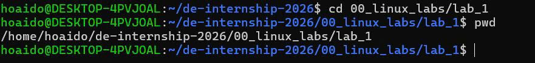

# LAB 1 - LINUX BASICS

## Bài 1.1

### Đề bài

Hiển thị đường dẫn đầy đủ của thư mục hiện tại bạn đang đứng.

### Lệnh thực thi

```bash
hoaido@DESKTOP-4PVJOAL:~/de-internship-2026/00_linux_labs/lab_1$ pwd
/home/hoaido/de-internship-2026/00_linux_labs/lab_1

---

## Bài 1.2

### Đề bài

Liệt kê toàn bộ các file trong thư mục hiện tại bao gồm cả các file ẩn (bắt đầu bằng dấu `.`) kèm theo kích thước định dạng dễ đọc như KB/MB.

### Lệnh thực thi

```bash
hoaido@DESKTOP-4PVJOAL:~/de-internship-2026/00_linux_labs/lab_1$ ls -laH
total 60
drwxr-xr-x 2 hoaido hoaido  4096 Jul 22 07:32 .
drwxr-xr-x 3 hoaido hoaido  4096 Jul 21 16:23 ..
-rwxr-xr-x 1 hoaido hoaido 48792 Jul 21 17:00 bai-1.1.jpg
-rw-r--r-- 1 hoaido hoaido   605 Jul 22 07:32 basic_answer.md
