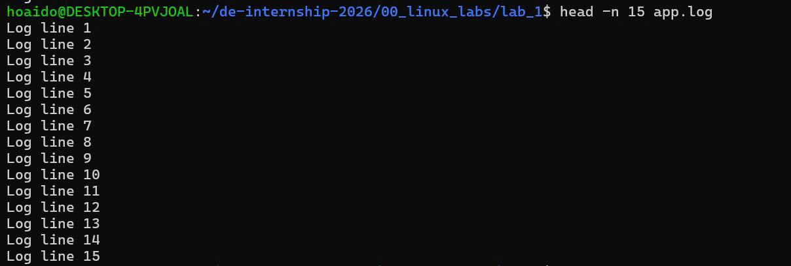
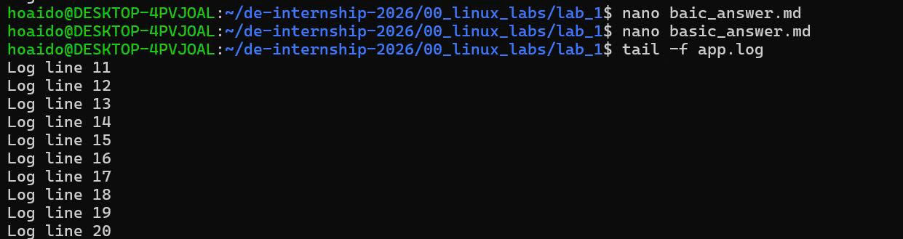
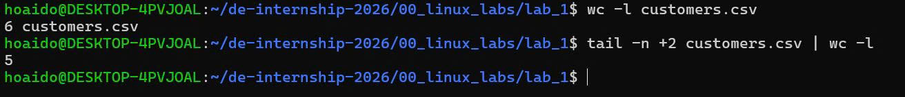
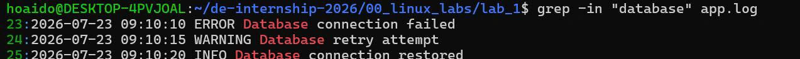
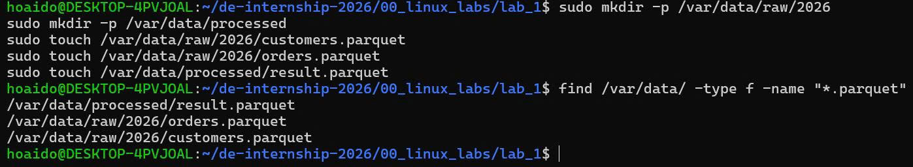
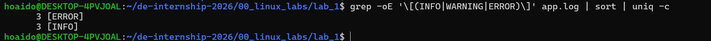
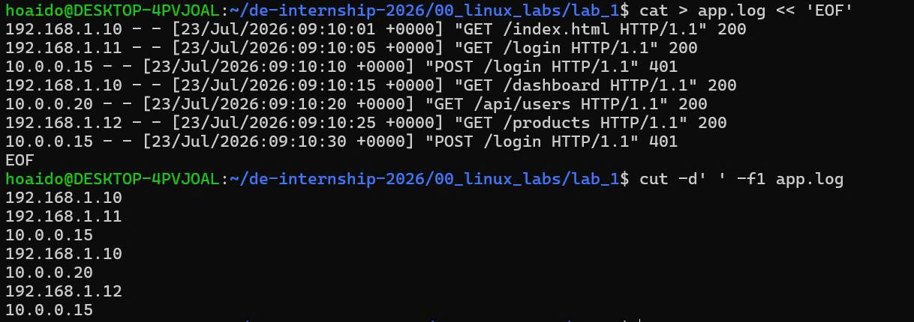
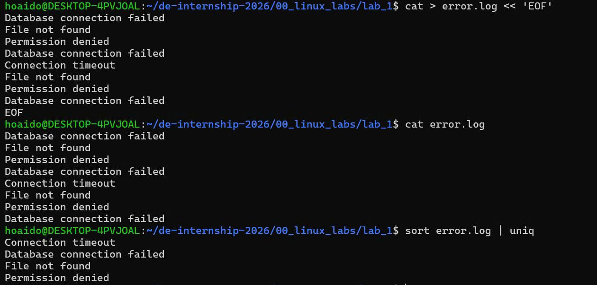
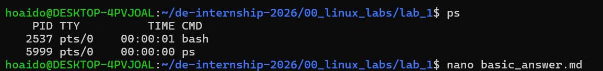

/# LAB 1 - LINUX BASICS

---

# CHỦ ĐỀ 1: THAO TÁC HỆ THỐNG FILE & ĐIỀU HƯỚNG CLI

## Bài 1.1

### Đề bài

Hiển thị đường dẫn đầy đủ của thư mục hiện tại bạn đang đứng.

### Lệnh thực thi

```bash
hoaido@DESKTOP-4PVJOAL:~/de-internship-2026/00_linux_labs/lab_1$ pwd
/home/hoaido/de-internship-2026/00_linux_labs/lab_1
```

### Ảnh minh chứng


---

## Bài 1.2

### Đề bài

Liệt kê toàn bộ các file trong thư mục hiện tại bao gồm cả các file ẩn (bắt đầu bằng dấu `.`) kèm theo kích thước định dạng dễ đọc như KB/MB.

### Lệnh thực thi

```bash
hoaido@DESKTOP-4PVJOAL:~/de-internship-2026/00_linux_labs/lab_1$ ls -laH
total 60
drwxr-xr-x 2 hoaido hoaido  4096 Jul 22 07:32 .
drwxr-xr-x 3 hoaido hoaido  4096 Jul 21 16:23 ..
-rwxr-xr-x 1 hoaido hoaido 48792 Jul 21 17:00 bai-1.1.jpg
-rw-r--r-- 1 hoaido hoaido   605 Jul 22 07:32 basic_answer.md
```

### Ảnh minh chứng


---

## Bài 1.3

### Đề bài

Tạo cấu trúc thư mục `data/raw/2026/07` bằng một lệnh duy nhất.

### Lệnh thực thi

```bash
mkdir -p data/raw/2026/07
```

### Kiểm tra kết quả

```bash
ls -R 00_linux_labs
```

### Kết quả

```text
00_linux_labs:
lab_1

00_linux_labs/lab_1:
```

Sau khi thực hiện tạo thư mục:

```text
.
├── data
│   └── raw
│       └── 2026
│           └── 07
└── images
```

### Ảnh minh chứng


---

## Bài 1.4

### Đề bài

Tạo file `README.txt` chứa nội dung `Data Engineering Curriculum 2026`.

### Lệnh thực thi

```bash
echo "Data Engineering Curriculum 2026" > README.txt
```

### Kiểm tra kết quả

```bash
cat README.txt
```

### Kết quả

```text
Data Engineering Curriculum 2026
```

### Ảnh minh chứng


---

## Bài 1.5

### Đề bài

Sao chép file `README.txt` vào thư mục `data/raw/2026/07/`.

### Lệnh thực thi

```bash
cp README.txt data/raw/2026/07/
```

### Kiểm tra kết quả

```bash
ls -l data/raw/2026/07/
```

### Kết quả

```text
total 4
-rw-r--r-- 1 hoaido hoaido 33 Jul 22 08:24 README.txt
```

### Ảnh minh chứng


---

## Bài 1.6

### Đề bài

Di chuyển tệp `README.txt` trong thư mục `data/raw/2026/07/` ra thư mục cha `data/raw/2026/` và đổi tên thành `info.metadata`.

### Lệnh thực thi

```bash
mv data/raw/2026/07/README.txt data/raw/2026/info.metadata
```

### Kiểm tra kết quả

```bash
ls -l data/raw/2026/
```

### Kết quả

```text
total 8
drwxr-xr-x 2 hoaido hoaido 4096 Jul 22 08:50 07
-rw-r--r-- 1 hoaido hoaido   33 Jul 22 08:49 info.metadata
```

### Kiểm tra nội dung file

```bash
cat data/raw/2026/info.metadata
```

### Kết quả

```text
Data Engineering Curriculum 2026
```

### Ảnh minh chứng


---

## Bài 1.7

### Đề bài

Kiểm tra dung lượng ổ đĩa còn trống của toàn bộ các phân vùng trên hệ thống.

### Lệnh thực thi

```bash
df -h
```

### Kết quả

```text
Filesystem      Size  Used Avail Use% Mounted on
none            3.9G     0  3.9G   0% /usr/lib/modules/6.18.33.2-microsoft-standard-WSL2
none            3.9G  4.0K  3.9G   1% /mnt/wsl
drivers         477G  334G  143G  71% /usr/lib/wsl/drivers
/dev/sdd       1007G  2.1G  954G   1% /
none            3.9G   64K  3.9G   1% /mnt/wslg
none            3.9G     0  3.9G   0% /usr/lib/wsl/lib
rootfs          3.9G  2.8M  3.9G   1% /init
none            3.9G  508K  3.9G   1% /run
none            3.9G     0  3.9G   0% /run/lock
none            3.9G     0  3.9G   0% /run/shm
none            3.9G   80K  3.9G   1% /mnt/wslg/versions.txt
none            3.9G   80K  3.9G   1% /mnt/wslg/doc
C:\             477G  334G  143G  71% /mnt/c
D:\             487G  111G  377G  23% /mnt/d
G:\             200G   64G  137G  32% /mnt/g
tmpfs           787M   20K  787M   1% /run/user/1000
```

### Ảnh minh chứng


---

## Bài 1.8

### Đề bài

Tính toán tổng dung lượng thực tế đang bị chiếm dụng bởi thư mục `data/` và hiển thị kết quả ở định dạng dễ đọc.

### Lệnh thực thi

```bash
du -sh data/
```

### Kết quả

```text
20K     data/
```

### Ảnh minh chứng


---

## Bài 1.9

### Đề bài

Tạo một liên kết mềm (Symbolic Link) tên là `latest_data` trỏ tới thư mục `data/raw/2026/07/` ngay tại thư mục hiện hành.

### Lệnh thực thi

```bash
ln -s data/raw/2026/07/ latest_data
```

### Kiểm tra kết quả

```bash
ls -l latest_data
```

### Kết quả

```text
lrwxrwxrwx 1 hoaido hoaido 17 Jul 22 16:17 latest_data -> data/raw/2026/07/
```

### Ảnh minh chứng


---

## Bài 1.10

### Đề bài

Thay đổi thời gian sửa đổi của file `data/raw/2026/info.metadata` thành ngày `15/06/2026` lúc `12:00`.

### Lệnh thực thi

```bash
touch -t 202606151200 data/raw/2026/info.metadata
```

### Kiểm tra kết quả

```bash
ls -l --full-time data/raw/2026/info.metadata
```

### Kết quả

```text
-rw-r--r-- 1 hoaido hoaido 33 2026-06-15 12:00:00.000000000 +0000 data/raw/2026/info.metadata
```

### Ảnh minh chứng


---

# CHỦ ĐỀ 2: PHÂN QUYỀN FILE & QUẢN LÝ SỞ HỮU

## Bài 2.1

### Đề bài

Xem quyền truy cập chi tiết của tệp `info.metadata`.

### Lệnh thực thi

```bash
ls -l data/raw/2026/info.metadata
```

### Kết quả

```text
-rw-r--r-- 1 hoaido hoaido 33 Jun 15 12:00 data/raw/2026/info.metadata
```

### Giải thích

- `-rw-r--r--`: quyền truy cập của file.
- `rw-`: Owner (`hoaido`) có quyền đọc và ghi.
- `r--`: Group (`hoaido`) chỉ có quyền đọc.
- `r--`: Others chỉ có quyền đọc.
- `33`: kích thước file là 33 bytes.
- `Jun 15 12:00`: thời gian sửa đổi của file.
- `data/raw/2026/info.metadata`: đường dẫn của file.

### Ảnh minh chứng


---
## Bài 2.2

### Đề bài

Cấp quyền thực thi (Execute) cho tệp `script.sh` chỉ dành cho người sở hữu tệp (Owner).

### Lệnh thực thi

```bash
touch script.sh
chmod u+x script.sh
```

### Kiểm tra kết quả

```bash
ls -l script.sh
```

### Kết quả

```text
-rwxr--r-- 1 hoaido hoaido 0 Jul 22 16:57 script.sh
```

### Giải thích

- `-rwx`: Owner (`hoaido`) có quyền đọc (`r`), ghi (`w`) và thực thi (`x`).
- `r--`: Group (`hoaido`) chỉ có quyền đọc.
- `r--`: Others chỉ có quyền đọc.
- Quyền `x` đã được thêm cho Owner, đáp ứng yêu cầu của bài.

### Ảnh minh chứng


---
## Bài 2.3

### Đề bài

Thu hồi quyền ghi (Write) của nhóm Khác (Others) đối với tệp `database.config`.

### Lệnh thực thi

```bash
touch database.config
ls -l database.config
chmod o-w database.config
ls -l database.config
```

### Kết quả trước khi thu hồi quyền ghi

```text
-rw-r--r-- 1 hoaido hoaido 0 Jul 22 16:59 database.config
```

### Kết quả sau khi thu hồi quyền ghi

```text
-rw-r--r-- 1 hoaido hoaido 0 Jul 22 16:59 database.config
```

### Giải thích

- `o`: đại diện cho Others.
- `-w`: thu hồi quyền Write.
- Quyền hiện tại của Others là `r--`, không có quyền ghi `w`.
- Lệnh `chmod o-w database.config` được thực hiện thành công.
- Do file ban đầu đã không có quyền ghi cho Others nên sau khi thực hiện lệnh, quyền của file không thay đổi.

### Ảnh minh chứng


---
## Bài 2.4

### Đề bài

Thiết lập phân quyền cho tệp `secure_key.pem` sao cho chỉ người sở hữu (Owner) có quyền đọc và viết, còn tất cả các nhóm khác không có quyền gì.

### Lệnh thực thi

```bash
touch secure_key.pem
chmod 600 secure_key.pem
```

### Kiểm tra kết quả

```bash
ls -l secure_key.pem
```

### Kết quả

```text
-rw------- 1 hoaido hoaido 0 Jul 22 17:07 secure_key.pem
```

### Giải thích

- `600`: thiết lập quyền đọc và ghi cho Owner.
- `rw-`: Owner (`hoaido`) có quyền đọc và ghi.
- `---`: Group không có quyền đọc, ghi hoặc thực thi.
- `---`: Others không có quyền đọc, ghi hoặc thực thi.
- File `secure_key.pem` đã được thiết lập đúng quyền theo yêu cầu.

### Ảnh minh chứng


---

## Bài 2.5

### Đề bài

Chuyển đổi chủ sở hữu của tệp `app.log` thành người dùng `admin`.

### Lệnh thực thi

Tạo user `admin` và sử dụng group `admin` đã tồn tại:

```bash
sudo useradd -g admin admin
```

Kiểm tra user `admin`:

```bash
id admin
```

Thay đổi chủ sở hữu của file `app.log`:

```bash
sudo chown admin app.log
```

### Kiểm tra kết quả

```bash
ls -l app.log
```

### Kết quả

```text
uid=1001(admin) gid=106(admin) groups=106(admin)
```

```text
-rw-r--r-- 1 admin hoaido 0 Jul 23 08:00 app.log
```

### Giải thích

- User `admin` đã được tạo thành công và thuộc group `admin`.
- Lệnh `sudo chown admin app.log` đã thay đổi Owner của file `app.log`.
- Trước khi thay đổi, Owner của file là `hoaido`.
- Sau khi thay đổi, Owner của file là `admin`.
- Group sở hữu file vẫn là `hoaido`.
- Kết quả `-rw-r--r-- 1 admin hoaido` xác nhận Owner hiện tại là `admin`.

### Ảnh minh chứng


---

## Bài 2.6

### Đề bài

Chuyển đổi đồng thời chủ sở hữu thành `admin` và nhóm sở hữu thành `developers` cho thư mục `data/`.

### Lệnh thực thi

Tạo group `developers`:

```bash
sudo groupadd developers
```

Kiểm tra group:

```bash
getent group developers
```

### Kết quả

```text
developers:x:1001:
```

Thay đổi Owner và Group của thư mục `data/`:

```bash
sudo chown admin:developers data/
```

### Kiểm tra kết quả

```bash
ls -ld data/
```

### Kết quả

```text
drwxr-xr-x 3 admin developers 4096 Jul 22 07:54 data/
```

### Giải thích

- `sudo`: thực hiện lệnh với quyền quản trị.
- `chown`: thay đổi chủ sở hữu.
- `admin`: Owner mới của thư mục.
- `developers`: Group mới của thư mục.
- `data/`: thư mục cần thay đổi quyền sở hữu.
- Kết quả `admin developers` xác nhận Owner của `data/` là `admin` và Group sở hữu là `developers`.

### Ảnh minh chứng


---
## Bài 2.7

### Đề bài

Áp dụng quyền `755` đệ quy cho toàn bộ thư mục con và tệp tin nằm bên trong thư mục `data/`.

### Lệnh thực thi

Kiểm tra quyền ban đầu của thư mục `data/`:

```bash
ls -l data/
```

Kết quả:

```text
total 4
drwxr-xr-x 3 hoaido hoaido 4096 Jul 22 07:54 raw
```

Áp dụng quyền `755` đệ quy cho thư mục `data/`:

```bash
sudo chmod -R 755 data/
```

### Kiểm tra quyền của thư mục `data/`

```bash
ls -ld data/
```

### Kết quả

```text
drwxr-xr-x 3 admin developers 4096 Jul 22 07:54 data/
```

### Kiểm tra toàn bộ thư mục và tệp bên trong

```bash
ls -lR data/
```

### Kết quả

```text
data/:
total 4
drwxr-xr-x 3 hoaido hoaido 4096 Jul 22 07:54 raw

data/raw:
total 4
drwxr-xr-x 3 hoaido hoaido 4096 Jul 22 07:54 2026

data/raw/2026:
total 8
drwxr-xr-x 2 hoaido hoaido 4096 Jul 22 08:50 07
-rwxr-xr-x 1 hoaido hoaido 33 Jun 15 12:00 info.metadata

data/raw/2026/07:
total 0
```

### Giải thích

- `chmod -R 755 data/` áp dụng quyền `755` đệ quy cho thư mục `data/` và toàn bộ nội dung bên trong.
- `755` tương ứng với:
  - Owner: `rwx` — đọc, ghi, thực thi.
  - Group: `r-x` — đọc, thực thi.
  - Others: `r-x` — đọc, thực thi.
- Các thư mục và file bên trong `data/` đã được áp dụng quyền `755`.
- Lệnh `chmod` chỉ thay đổi quyền truy cập, không thay đổi Owner hoặc Group.
- Vì vậy, Owner/Group của `data/` vẫn là `admin:developers`, trong khi các thư mục và file bên trong vẫn giữ Owner/Group hiện tại là `hoaido:hoaido`.

### Ảnh minh chứng


---
## Bài 2.8

### Đề bài

Giải thích tại sao không nên cấp quyền `777` cho thư mục chứa code chạy hoặc các file cấu hình nhạy cảm trong môi trường thực tế.

### Phân tích quyền `777`

Quyền `777` tương ứng với:

```text
Owner   → rwx
Group   → rwx
Others  → rwx
```

Trong đó:

- `r` (Read): quyền đọc.
- `w` (Write): quyền ghi và chỉnh sửa.
- `x` (Execute): quyền thực thi hoặc truy cập thư mục.

Khi một file hoặc thư mục được cấp quyền `777`, Owner, Group và Others đều có toàn bộ quyền đọc, ghi và thực thi.

Ví dụ:

```text
-rwxrwxrwx
```

Đối với thư mục:

```text
drwxrwxrwx
```

### Rủi ro bảo mật

Không nên sử dụng quyền `777` trong môi trường thực tế vì những lý do sau:

1. **Cho phép người dùng không được phép chỉnh sửa file**

   Bất kỳ người dùng nào có quyền truy cập đều có thể thay đổi nội dung của file.

2. **Có thể xóa hoặc thay thế dữ liệu**

   Với thư mục có quyền ghi cho Others, người dùng khác có thể tạo, sửa hoặc xóa các file bên trong.

3. **Có nguy cơ chèn mã độc**

   Nếu thư mục chứa code chạy có quyền `777`, người dùng khác có thể chỉnh sửa hoặc chèn mã độc vào code. Khi chương trình được thực thi, mã độc có thể được chạy cùng với chương trình.

4. **Có thể làm thay đổi file cấu hình nhạy cảm**

   Các file cấu hình chứa thông tin quan trọng như mật khẩu, API key hoặc thông tin kết nối cơ sở dữ liệu có thể bị thay đổi trái phép.

5. **Tăng nguy cơ mất an toàn hệ thống**

   Việc cấp quyền quá rộng làm tăng khả năng xảy ra lỗi hoặc hành vi truy cập trái phép.

### Nguyên tắc bảo mật

Thay vì sử dụng quyền `777`, nên áp dụng nguyên tắc **Least Privilege** (quyền tối thiểu).

Mỗi người dùng hoặc nhóm chỉ nên được cấp những quyền cần thiết để thực hiện công việc của mình.

Ví dụ:

- File thông thường có thể sử dụng quyền `644`.
- File thực thi có thể sử dụng quyền `755`.
- File chứa thông tin nhạy cảm có thể sử dụng quyền `600`.

### Kết luận

Quyền `777` cho phép Owner, Group và Others đều có toàn bộ quyền đọc, ghi và thực thi. Điều này rất nguy hiểm trong môi trường thực tế vì có thể dẫn đến việc dữ liệu bị sửa đổi, xóa hoặc chèn mã độc.

Vì vậy, không nên sử dụng quyền `777` một cách tùy tiện. Thay vào đó, cần cấp quyền tối thiểu cần thiết theo nguyên tắc **Least Privilege** để đảm bảo an toàn và bảo mật cho hệ thống.
## Bài 2.9

### Đề bài

Thay đổi giá trị `umask` để từ thời điểm này, các tệp tin mới được tạo bởi user hiện tại mặc định có quyền `644`.

### Lệnh thực thi

Thiết lập `umask`:

```bash
umask 022
```

Kiểm tra bằng cách tạo một file mới:

```bash
touch umask_test.txt
```

Kiểm tra quyền của file:

```bash
ls -l umask_test.txt
```

### Kết quả

```text
-rw-r--r-- 1 hoaido hoaido 0 Jul 23 08:46 umask_test.txt
```

### Phân tích

File `umask_test.txt` có quyền:

```text
-rw-r--r--
```

Tương ứng với quyền số:

```text
644
```

Trong đó:

```text
Owner   → rw-   → Đọc và ghi
Group   → r--   → Chỉ đọc
Others  → r--   → Chỉ đọc
```

Giá trị `umask` được thiết lập là:

```text
022
```

Với file thông thường, quyền mặc định ban đầu là `666`. Sau khi áp dụng `umask 022`, quyền của file mới được tạo là:

```text
666 - 022 = 644
```

### Kết luận

Sau khi thiết lập `umask 022`, file mới `umask_test.txt` được tạo với quyền `644` (`-rw-r--r--`). Điều này đáp ứng yêu cầu của bài.

### Ảnh minh chứng


---

## Bài 2.10

### Đề bài

Khắc phục lỗi `Permission Denied` khi chạy Python script ghi file log vào thư mục `/var/log/my_app/` mà không cần sử dụng `sudo` khi chạy script.

### Bước 1: Tạo thư mục log

#### Lệnh thực thi

```bash
sudo mkdir -p /var/log/my_app
```

Kiểm tra thư mục:

```bash
ls -ld /var/log/my_app
```

#### Kết quả ban đầu

```text
drwxr-xr-x 2 root root 4096 Jul 23 09:03 /var/log/my_app
```

Thư mục thuộc sở hữu của `root:root`.

### Bước 2: Tạo Python script

Tạo file:

```bash
nano write_log.py
```

Nội dung file:

```python
with open("/var/log/my_app/app.log", "a") as f:
    f.write("Data Engineering log\n")

print("Write log successfully")
```

### Bước 3: Kiểm tra lỗi Permission Denied

Chạy script mà không sử dụng `sudo`:

```bash
python3 write_log.py
```

#### Kết quả

```text
Traceback (most recent call last):
  File "/home/hoaido/de-internship-2026/00_linux_labs/lab_1/write_log.py", line 1, in <module>
    with open("/var/log/my_app/app.log", "a") as f:
         ^^^^^^^^^^^^^^^^^^^^^^^^^^^^^^^^^^^^
PermissionError: [Errno 13] Permission denied: '/var/log/my_app/app.log'
```

Nguyên nhân là user `hoaido` không có quyền ghi vào thư mục `/var/log/my_app/`, vì thư mục đang thuộc sở hữu của `root:root`.

### Bước 4: Cấp quyền sở hữu cho user `hoaido`

Thay đổi Owner và Group của thư mục:

```bash
sudo chown -R hoaido:hoaido /var/log/my_app
```

Kiểm tra:

```bash
ls -ld /var/log/my_app
```

#### Kết quả

```text
drwxr-xr-x 2 hoaido hoaido 4096 Jul 23 09:03 /var/log/my_app
```

Thư mục `/var/log/my_app` hiện thuộc sở hữu của user `hoaido` và group `hoaido`.

### Bước 5: Chạy lại Python script

Chạy script mà không sử dụng `sudo`:

```bash
python3 write_log.py
```

#### Kết quả

```text
Write log successfully
```

Script đã ghi log thành công.

### Bước 6: Kiểm tra nội dung file log

```bash
cat /var/log/my_app/app.log
```

#### Kết quả

```text
Data Engineering log
```

### Bước 7: Kiểm tra quyền và Owner của file log

```bash
ls -l /var/log/my_app/app.log
```

#### Kết quả

```text
-rw-r--r-- 1 hoaido hoaido 21 Jul 23 09:05 /var/log/my_app/app.log
```

### Giải thích

Ban đầu, thư mục `/var/log/my_app` có Owner và Group là:

```text
root root
```

Do đó, user `hoaido` không có quyền ghi file vào thư mục này và khi chạy Python script đã xảy ra lỗi:

```text
PermissionError: [Errno 13] Permission denied
```

Sau đó, sử dụng lệnh:

```bash
sudo chown -R hoaido:hoaido /var/log/my_app
```

để thay đổi Owner và Group của thư mục thành `hoaido`.

Sau khi thay đổi quyền sở hữu, user `hoaido` có thể chạy:

```bash
python3 write_log.py
```

mà không cần sử dụng `sudo`, và script có thể ghi dữ liệu vào:

```text
/var/log/my_app/app.log
```

### Kết luận

Đã khắc phục thành công lỗi `Permission Denied`. Sau khi cấp quyền sở hữu thư mục `/var/log/my_app` cho user `hoaido`, Python script có thể ghi log thành công mà không cần chạy bằng `sudo`.

Kết quả cuối cùng:

```text
Write log successfully
```

File log:

```text
/var/log/my_app/app.log
```

Owner:

```text
hoaido:hoaido
```

### Ảnh minh chứng


---
## CHỦ ĐỀ 3: Tìm kiếm, Bộ lọc & Xử lý Văn bản

## Bài 3.1

### Đề bài

Xem 15 dòng đầu tiên của file log hệ thống `app.log` bằng lệnh `head -n 15`.

### Lệnh thực thi

Tạo file `app.log`:

```bash
touch app.log
```

Tạo dữ liệu mẫu gồm 20 dòng:

```bash
for i in {1..20}; do echo "Log line $i" >> app.log; done
```

Kiểm tra nội dung file:

```bash
cat app.log
```

Sử dụng `head -n 15` để hiển thị 15 dòng đầu tiên:

```bash
head -n 15 app.log
```

### Kết quả

```text
Log line 1
Log line 2
Log line 3
Log line 4
Log line 5
Log line 6
Log line 7
Log line 8
Log line 9
Log line 10
Log line 11
Log line 12
Log line 13
Log line 14
Log line 15
```

### Giải thích

Lệnh:

```bash
head -n 15 app.log
```

được sử dụng để hiển thị **15 dòng đầu tiên** của file `app.log`.

Trong đó:

- `head`: Hiển thị phần đầu của file.
- `-n 15`: Yêu cầu hiển thị 15 dòng.
- `app.log`: File cần đọc.

File `app.log` có tổng cộng 20 dòng, nhưng lệnh `head -n 15` chỉ hiển thị từ `Log line 1` đến `Log line 15`.

### Kết luận

Đã thực hiện thành công yêu cầu của Bài 3.1. Lệnh `head -n 15 app.log` hiển thị chính xác 15 dòng đầu tiên của file log.

### Ảnh minh chứng



---
## Bài 3.2

### Đề bài

Theo dõi liên tục các dòng log mới được ghi thêm vào cuối file `app.log` bằng lệnh `tail -f`.

### Lệnh thực thi

```bash
tail -f app.log
```

### Kết quả

```text
Log line 11
Log line 12
Log line 13
Log line 14
Log line 15
Log line 16
Log line 17
Log line 18
Log line 19
Log line 20
```

### Giải thích

Lệnh:

```bash
tail -f app.log
```

được sử dụng để theo dõi liên tục nội dung được ghi thêm vào cuối file `app.log`.

Trong đó:

- `tail`: Hiển thị phần cuối của file.
- `-f`: Theo dõi file liên tục (follow), khi có dữ liệu mới được ghi vào file thì dữ liệu mới sẽ được hiển thị ngay trên Terminal.
- `app.log`: File log cần theo dõi.

Khi chạy lệnh, Terminal hiển thị 10 dòng cuối cùng của file `app.log`, từ `Log line 11` đến `Log line 20`.

Lệnh `tail -f` tiếp tục chạy và chờ các dòng log mới được ghi thêm vào file. Khi muốn dừng theo dõi, nhấn:

```text
Ctrl + C
```

### Ảnh minh chứng



---
## Bài 3.3

### Đề bài

Tìm tất cả các dòng có chứa từ khóa `ERROR` trong file `app.log` bằng lệnh `grep`.

### Lệnh thực thi

Thêm dữ liệu log mẫu vào file `app.log`:

```bash
cat >> app.log << 'EOF'
2026-07-23 09:10:01 INFO Application started successfully
2026-07-23 09:10:05 INFO User login successful
2026-07-23 09:10:10 ERROR Database connection failed
2026-07-23 09:10:15 WARNING Database retry attempt
2026-07-23 09:10:20 INFO Database connection restored
2026-07-23 09:10:25 ERROR Failed to load configuration
2026-07-23 09:10:30 INFO Application is running
EOF
```

Tìm các dòng chứa từ khóa `ERROR`:

```bash
grep "ERROR" app.log
```

### Kết quả

```text
2026-07-23 09:10:10 ERROR Database connection failed
2026-07-23 09:10:25 ERROR Failed to load configuration
```

### Giải thích

Lệnh:

```bash
grep "ERROR" app.log
```

được sử dụng để tìm kiếm và hiển thị tất cả các dòng có chứa chuỗi `ERROR` trong file `app.log`.

Trong đó:

- `grep`: Công cụ tìm kiếm và lọc nội dung văn bản.
- `"ERROR"`: Từ khóa cần tìm.
- `app.log`: File được tìm kiếm.

Kết quả chỉ hiển thị 2 dòng có chứa từ khóa `ERROR`:

```text
2026-07-23 09:10:10 ERROR Database connection failed
2026-07-23 09:10:25 ERROR Failed to load configuration
```

Các dòng chứa `INFO` và `WARNING` không được hiển thị vì không chứa từ khóa `ERROR`.

### Ảnh minh chứng



---
## Bài 3.3

### Đề bài

Đếm tổng số dòng trong file `customers.csv` bằng lệnh `wc -l`.

### Lệnh thực thi

Đếm tổng số dòng của file:

```bash
wc -l customers.csv
```

Để đếm riêng số dòng dữ liệu, không tính dòng tiêu đề:

```bash
tail -n +2 customers.csv | wc -l
```

### Kết quả

Tổng số dòng trong file:

```text
6 customers.csv
```

Số dòng dữ liệu không tính dòng tiêu đề:

```text
5
```

### Giải thích

Lệnh:

```bash
wc -l customers.csv
```

sử dụng tùy chọn `-l` để đếm số dòng trong file `customers.csv`.

Kết quả:

```text
6 customers.csv
```

cho biết file `customers.csv` có tổng cộng **6 dòng**.

Trong đó, file có:

- 1 dòng tiêu đề.
- 5 dòng dữ liệu khách hàng.

Để kiểm tra riêng số dòng dữ liệu và bỏ qua dòng tiêu đề, sử dụng:

```bash
tail -n +2 customers.csv | wc -l
```

Kết quả là:

```text
5
```

### Ảnh minh chứng


---
## Bài 3.5

### Đề bài

Tìm kiếm không phân biệt chữ hoa/chữ thường từ khóa `database` và in ra kèm số thứ tự dòng xuất hiện trong tệp log bằng lệnh `grep -in`.

### Lệnh thực thi

```bash
grep -in "database" app.log
```

### Kết quả

```text
23:2026-07-23 09:10:10 ERROR Database connection failed
24:2026-07-23 09:10:15 WARNING Database retry attempt
25:2026-07-23 09:10:20 INFO Database connection restored
```

### Giải thích

Lệnh:

```bash
grep -in "database" app.log
```

được sử dụng để tìm kiếm từ khóa `database` trong file `app.log`, không phân biệt chữ hoa và chữ thường, đồng thời hiển thị số thứ tự dòng.

Trong đó:

- `grep`: Tìm kiếm nội dung trong file.
- `-i`: Không phân biệt chữ hoa và chữ thường. Vì vậy, `database`, `Database` và `DATABASE` đều được tìm thấy.
- `-n`: Hiển thị số thứ tự dòng chứa kết quả tìm kiếm.
- `"database"`: Từ khóa cần tìm.
- `app.log`: File log cần tìm kiếm.

Kết quả cho thấy từ khóa `Database` xuất hiện tại các dòng **23, 24 và 25** của file `app.log`.

### Ảnh minh chứng



---
## Bài 3.6

### Đề bài

Quét và tìm kiếm tất cả các tệp tin có định dạng đuôi `.parquet` nằm trong toàn bộ thư mục `/var/data/` bằng lệnh `find`.

### Lệnh thực thi

Tạo cấu trúc thư mục và các file `.parquet` để thực hành:

```bash
sudo mkdir -p /var/data/raw/2026
sudo mkdir -p /var/data/processed
sudo touch /var/data/raw/2026/customers.parquet
sudo touch /var/data/raw/2026/orders.parquet
sudo touch /var/data/processed/result.parquet
```

Tìm tất cả các file có đuôi `.parquet`:

```bash
find /var/data/ -type f -name "*.parquet"
```

### Kết quả

```text
/var/data/processed/result.parquet
/var/data/raw/2026/orders.parquet
/var/data/raw/2026/customers.parquet
```

### Giải thích

Lệnh:

```bash
find /var/data/ -type f -name "*.parquet"
```

được sử dụng để tìm kiếm tất cả các file có đuôi `.parquet` trong thư mục `/var/data/` và toàn bộ các thư mục con bên trong.

Trong đó:

- `find`: Lệnh tìm kiếm file và thư mục.
- `/var/data/`: Thư mục bắt đầu tìm kiếm.
- `-type f`: Chỉ tìm kiếm các file thông thường.
- `-name "*.parquet"`: Tìm các file có tên kết thúc bằng `.parquet`.
- `*`: Đại diện cho bất kỳ chuỗi ký tự nào.

Kết quả tìm kiếm gồm 3 file:

```text
/var/data/processed/result.parquet
/var/data/raw/2026/orders.parquet
/var/data/raw/2026/customers.parquet
```

Các file nằm ở các thư mục con khác nhau nhưng đều được `find` tìm thấy vì lệnh đã quét đệ quy toàn bộ `/var/data/`.

### Ảnh minh chứng



---
## Bài 3.7

### Đề bài

Sử dụng Pipe `|` kết hợp `grep` và `wc -l` để đếm tổng số dòng chứa `[ERROR]` trong file `app.log`.

### Lệnh thực thi

Thêm dữ liệu log có chứa `[ERROR]`:

```bash
cat >> app.log << 'EOF'
2026-07-23 09:20:01 [INFO] Application started
2026-07-23 09:20:05 [ERROR] Database connection failed
2026-07-23 09:20:10 [INFO] Retrying database connection
2026-07-23 09:20:15 [ERROR] Connection timeout
2026-07-23 09:20:20 [INFO] Database connection restored
2026-07-23 09:20:25 [ERROR] Failed to load configuration
EOF
```

Đếm số dòng chứa `[ERROR]`:

```bash
grep "\[ERROR\]" app.log | wc -l
```

### Kết quả

```text
3
```

### Giải thích

Lệnh:

```bash
grep "\[ERROR\]" app.log | wc -l
```

sử dụng Pipe `|` để kết hợp hai lệnh.

- `grep "\[ERROR\]" app.log`: Tìm và lọc các dòng chứa `[ERROR]`.
- `|`: Chuyển kết quả của lệnh `grep` sang lệnh tiếp theo.
- `wc -l`: Đếm số dòng nhận được từ lệnh `grep`.

Kết quả:

```text
3
```

cho biết file `app.log` hiện có **3 dòng chứa `[ERROR]`**.

### Ảnh minh chứng



---
## Bài 3.8

### Đề bài

Dùng `sort` và `uniq -c` để thống kê số lần xuất hiện của từng mức log (`INFO`, `WARNING`, `ERROR`) trong file `app.log`.

### Lệnh thực thi

```bash
grep -oE '\[(INFO|WARNING|ERROR)\]' app.log | sort | uniq -c
```

### Kết quả

```text
      3 [ERROR]
      3 [INFO]
```

### Giải thích

Lệnh:

```bash
grep -oE '\[(INFO|WARNING|ERROR)\]' app.log | sort | uniq -c
```

sử dụng Pipe `|` để kết hợp nhiều lệnh xử lý dữ liệu.

Trong đó:

- `grep -oE '\[(INFO|WARNING|ERROR)\]' app.log`: Tìm và chỉ lấy các mức log có dạng `[INFO]`, `[WARNING]` hoặc `[ERROR]`.
- `sort`: Sắp xếp các kết quả để những giá trị giống nhau nằm cạnh nhau.
- `uniq -c`: Đếm số lần xuất hiện của từng giá trị.

Kết quả:

```text
      3 [ERROR]
      3 [INFO]
```

cho biết trong các dòng log có định dạng mức log nằm trong dấu `[]`:

- `[ERROR]` xuất hiện 3 lần.
- `[INFO]` xuất hiện 3 lần.
- Không có kết quả `[WARNING]` trong dữ liệu được tìm kiếm.

Các dòng `WARNING` trước đó trong `app.log` không được tính vì chúng có dạng `WARNING`, không có dấu `[]`.

### Ảnh minh chứng



---
## Bài 3.9

### Đề bài

Sử dụng `awk` để in ra cột 1 và cột 3 của file `customers.csv`.

### Lệnh thực thi

```bash
awk -F',' '{print $1, $3}' customers.csv
```

### Kết quả

```text
id email
1 an@example.com
2 binh@example.com
3 cuong@example.com
4 dung@example.com
5 em@example.com
```

### Giải thích

Lệnh:

```bash
awk -F',' '{print $1, $3}' customers.csv
```

được sử dụng để trích xuất và in ra cột 1 và cột 3 trong file `customers.csv`.

Trong đó:

- `awk`: Công cụ xử lý và trích xuất dữ liệu theo từng cột.
- `-F','`: Thiết lập dấu phẩy `,` làm ký tự phân cách giữa các cột.
- `$1`: Đại diện cho cột thứ nhất.
- `$3`: Đại diện cho cột thứ ba.
- `print $1, $3`: In ra cột 1 và cột 3.
- `customers.csv`: File dữ liệu cần xử lý.

Với dòng dữ liệu:

```text
1,Nguyen Van An,an@example.com
```

thì:

```text
$1 = 1
$2 = Nguyen Van An
$3 = an@example.com
```

Do đó, lệnh chỉ in ra:

```text
1 an@example.com
```

Kết quả cho thấy lệnh đã trích xuất chính xác cột `id` và `email` từ file `customers.csv`.

### Ảnh minh chứng



---
## Bài 3.10

### Đề bài

Sử dụng `sed` để thay thế chuỗi `INFO` thành `INFORMATION` trong file `app.log`.

### Lệnh thực thi

Thay thế trực tiếp chuỗi `INFO` thành `INFORMATION` trong file:

```bash
sed -i 's/INFO/INFORMATION/g' app.log
```

Kiểm tra các dòng đã được thay thế:

```bash
grep "INFORMATION" app.log
```

### Kết quả

```text
2026-07-23 09:10:01 INFORMATION Application started successfully
2026-07-23 09:10:05 INFORMATION User login successful
2026-07-23 09:10:20 INFORMATION Database connection restored
2026-07-23 09:10:30 INFORMATION Application is running
2026-07-23 09:20:01 [INFORMATION] Application started
2026-07-23 09:20:10 [INFORMATION] Retrying database connection
2026-07-23 09:20:20 [INFORMATION] Database connection restored
```

### Giải thích

Lệnh:

```bash
sed -i 's/INFO/INFORMATION/g' app.log
```

được sử dụng để tìm và thay thế chuỗi `INFO` thành `INFORMATION` trực tiếp trong file `app.log`.

Trong đó:

- `sed`: Công cụ xử lý và chỉnh sửa nội dung văn bản.
- `-i`: Chỉnh sửa trực tiếp file.
- `s`: Viết tắt của `substitute`, dùng để thay thế chuỗi.
- `INFO`: Chuỗi cần tìm.
- `INFORMATION`: Chuỗi được sử dụng để thay thế.
- `g`: Thay thế tất cả các lần xuất hiện của `INFO` trong mỗi dòng.
- `app.log`: File cần chỉnh sửa.

Sau khi thực hiện, các chuỗi `INFO` trong file đã được thay thế thành `INFORMATION`.

Lệnh:

```bash
grep "INFORMATION" app.log
```

được sử dụng để kiểm tra lại các dòng đã được thay đổi.

### Ảnh minh chứng


---

## Bài 3.8

### Đề bài

Sử dụng lệnh `cut` để trích xuất riêng cột địa chỉ IP (cột thứ nhất) từ các dòng log của Web Server.

### Lệnh thực thi

Tạo file `app.log` chứa dữ liệu log Web Server:

```bash
cat > app.log << 'EOF'
192.168.1.10 - - [23/Jul/2026:09:10:01 +0000] "GET /index.html HTTP/1.1" 200
192.168.1.11 - - [23/Jul/2026:09:10:05 +0000] "GET /login HTTP/1.1" 200
10.0.0.15 - - [23/Jul/2026:09:10:10 +0000] "POST /login HTTP/1.1" 401
192.168.1.10 - - [23/Jul/2026:09:10:15 +0000] "GET /dashboard HTTP/1.1" 200
10.0.0.20 - - [23/Jul/2026:09:10:20 +0000] "GET /api/users HTTP/1.1" 200
192.168.1.12 - - [23/Jul/2026:09:10:25 +0000] "GET /products HTTP/1.1" 200
10.0.0.15 - - [23/Jul/2026:09:10:30 +0000] "POST /login HTTP/1.1" 401
EOF
```

Trích xuất cột địa chỉ IP:

```bash
cut -d' ' -f1 app.log
```

### Kết quả

```text
192.168.1.10
192.168.1.11
10.0.0.15
192.168.1.10
10.0.0.20
192.168.1.12
10.0.0.15
```

### Giải thích

Lệnh:

```bash
cut -d' ' -f1 app.log
```

được sử dụng để trích xuất cột đầu tiên trong file log Web Server.

Trong đó:

- `cut`: Công cụ dùng để cắt và trích xuất dữ liệu từ mỗi dòng.
- `-d' '`: Sử dụng dấu cách làm ký tự phân cách giữa các cột.
- `-f1`: Lấy trường dữ liệu đầu tiên.
- `app.log`: File log cần xử lý.

Trong mỗi dòng log, địa chỉ IP nằm ở vị trí đầu tiên. Ví dụ:

```text
192.168.1.10 - - [23/Jul/2026:09:10:01 +0000] "GET /index.html HTTP/1.1" 200
```

Sau khi sử dụng:

```bash
cut -d' ' -f1 app.log
```

chỉ còn:

```text
192.168.1.10
```

Kết quả cho thấy lệnh `cut` đã trích xuất thành công địa chỉ IP của từng client từ các dòng log Web Server.

### Ảnh minh chứng


---

## Bài 3.9

### Đề bài

Đọc tệp log, tìm các dòng lỗi trùng nhau, lọc bỏ các dòng trùng lặp và sắp xếp danh sách lỗi duy nhất theo thứ tự bảng chữ cái, sử dụng kết hợp `sort` và `uniq`.

### Lệnh thực thi

Kiểm tra nội dung file `error.log`:

```bash
cat error.log
```

Sắp xếp các dòng lỗi và loại bỏ các dòng trùng lặp:

```bash
sort error.log | uniq
```

### Kết quả

```text
Connection timeout
Database connection failed
File not found
Permission denied
```

### Giải thích

Lệnh:

```bash
sort error.log | uniq
```

sử dụng Pipe `|` để kết hợp hai lệnh `sort` và `uniq`.

- `sort error.log`: Sắp xếp các dòng trong file `error.log` theo thứ tự bảng chữ cái.
- `|`: Chuyển kết quả của lệnh `sort` sang lệnh `uniq`.
- `uniq`: Loại bỏ các dòng bị trùng lặp liên tiếp.

Việc sử dụng `sort` trước `uniq` giúp đưa các dòng giống nhau về cạnh nhau, từ đó `uniq` có thể loại bỏ các dòng trùng lặp.

File ban đầu có các lỗi bị lặp lại:

```text
Database connection failed
File not found
Permission denied
```

Sau khi thực hiện:

```bash
sort error.log | uniq
```

chỉ còn danh sách các lỗi duy nhất:

```text
Connection timeout
Database connection failed
File not found
Permission denied
```

Các lỗi đã được sắp xếp theo thứ tự bảng chữ cái.

### Ảnh minh chứng


---
## Bài 3.10

### Đề bài

Sử dụng `awk` để tính tổng giá trị tiền ở cột 5 trong file `transactions.csv`, trong đó các cột được phân cách bằng dấu phẩy `,`.

### Lệnh thực thi

Tạo file `transactions.csv`:

```bash
cat > transactions.csv << 'EOF'
id,date,customer,type,amount
1,2026-07-23,C001,SALE,150000
2,2026-07-23,C002,SALE,250000
3,2026-07-23,C003,REFUND,50000
4,2026-07-23,C004,SALE,300000
5,2026-07-23,C005,SALE,200000
EOF
```

Tính tổng giá trị tiền ở cột 5:

```bash
awk -F',' 'NR > 1 {sum += $5} END {print sum}' transactions.csv
```

### Kết quả

```text
950000
```

### Giải thích

Lệnh:

```bash
awk -F',' 'NR > 1 {sum += $5} END {print sum}' transactions.csv
```

được sử dụng để tính tổng các giá trị trong cột 5 của file `transactions.csv`.

Trong đó:

- `awk`: Công cụ xử lý dữ liệu theo cột.
- `-F','`: Sử dụng dấu phẩy `,` làm ký tự phân cách giữa các cột.
- `NR > 1`: Bỏ qua dòng đầu tiên vì đây là dòng tiêu đề.
- `$5`: Đại diện cho cột thứ 5, tức cột `amount`.
- `sum += $5`: Cộng giá trị của cột 5 vào biến `sum`.
- `END`: Thực hiện lệnh sau khi đã xử lý tất cả các dòng.
- `print sum`: In ra tổng giá trị.

Các giá trị ở cột `amount` là:

```text
150000
250000
50000
300000
200000
```

Tổng:

```text
150000 + 250000 + 50000 + 300000 + 200000 = 950000
```

Kết quả cuối cùng:

```text
950000
```

### Ảnh minh chứng


---
## Bài 4.1

### Đề bài

Sử dụng lệnh `ps` để hiển thị danh sách các tiến trình đang chạy thuộc về người dùng hiện tại.

### Lệnh thực thi

```bash
ps
```

### Kết quả

```text
    PID TTY          TIME CMD
   2537 pts/0    00:00:01 bash
   5999 pts/0    00:00:00 ps
```

### Giải thích

Lệnh:

```bash
ps
```

được sử dụng để hiển thị thông tin về các tiến trình đang chạy trong phiên Terminal hiện tại.

Các cột trong kết quả:

- `PID`: Mã định danh của tiến trình (Process ID).
- `TTY`: Terminal mà tiến trình đang chạy.
- `TIME`: Tổng thời gian CPU mà tiến trình đã sử dụng.
- `CMD`: Tên lệnh hoặc chương trình của tiến trình.

Trong kết quả trên:

- Tiến trình có `PID 2537` là `bash`, đây là Shell đang chạy phiên Terminal hiện tại.
- Tiến trình có `PID 5999` là `ps`, chính là lệnh vừa được thực thi để hiển thị danh sách tiến trình.

### Ảnh minh chứng



---
