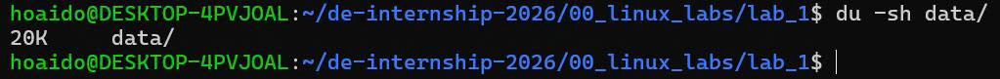
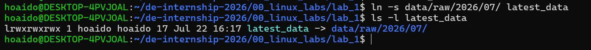
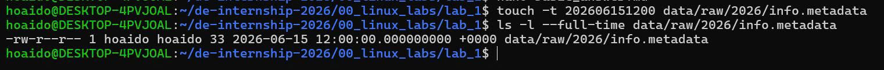
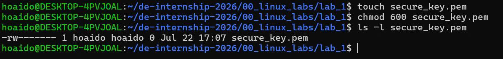
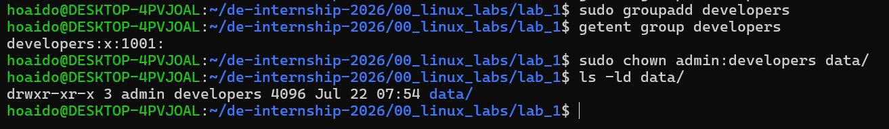

# LAB 1 - LINUX BASICS

---

# CHỦ ĐỀ 1: THAO TÁC HỆ THỐNG FILE & ĐIỀU HƯỚNG CLI

## Bài 1.1

### Đề bài

Hiển thị đường dẫn đầy đủ của thư mục hiện tại bạn đang đứng.

### Lệnh thực thi

```bash
hoaido@DESKTOP-4PVJOAL:~/de-internship-2026/00_linux_labs/lab_1$ pwd
/home/hoaido/de-internship-2026/00_linux_labs/lab_1
```

### Ảnh minh chứng


---

## Bài 1.2

### Đề bài

Liệt kê toàn bộ các file trong thư mục hiện tại bao gồm cả các file ẩn (bắt đầu bằng dấu `.`) kèm theo kích thước định dạng dễ đọc như KB/MB.

### Lệnh thực thi

```bash
hoaido@DESKTOP-4PVJOAL:~/de-internship-2026/00_linux_labs/lab_1$ ls -laH
total 60
drwxr-xr-x 2 hoaido hoaido  4096 Jul 22 07:32 .
drwxr-xr-x 3 hoaido hoaido  4096 Jul 21 16:23 ..
-rwxr-xr-x 1 hoaido hoaido 48792 Jul 21 17:00 bai-1.1.jpg
-rw-r--r-- 1 hoaido hoaido   605 Jul 22 07:32 basic_answer.md
```

### Ảnh minh chứng


---

## Bài 1.3

### Đề bài

Tạo cấu trúc thư mục `data/raw/2026/07` bằng một lệnh duy nhất.

### Lệnh thực thi

```bash
mkdir -p data/raw/2026/07
```

### Kiểm tra kết quả

```bash
ls -R 00_linux_labs
```

### Kết quả

```text
00_linux_labs:
lab_1

00_linux_labs/lab_1:
```

Sau khi thực hiện tạo thư mục:

```text
.
├── data
│   └── raw
│       └── 2026
│           └── 07
└── images
```

### Ảnh minh chứng


---

## Bài 1.4

### Đề bài

Tạo file `README.txt` chứa nội dung `Data Engineering Curriculum 2026`.

### Lệnh thực thi

```bash
echo "Data Engineering Curriculum 2026" > README.txt
```

### Kiểm tra kết quả

```bash
cat README.txt
```

### Kết quả

```text
Data Engineering Curriculum 2026
```

### Ảnh minh chứng


---

## Bài 1.5

### Đề bài

Sao chép file `README.txt` vào thư mục `data/raw/2026/07/`.

### Lệnh thực thi

```bash
cp README.txt data/raw/2026/07/
```

### Kiểm tra kết quả

```bash
ls -l data/raw/2026/07/
```

### Kết quả

```text
total 4
-rw-r--r-- 1 hoaido hoaido 33 Jul 22 08:24 README.txt
```

### Ảnh minh chứng


---

## Bài 1.6

### Đề bài

Di chuyển tệp `README.txt` trong thư mục `data/raw/2026/07/` ra thư mục cha `data/raw/2026/` và đổi tên thành `info.metadata`.

### Lệnh thực thi

```bash
mv data/raw/2026/07/README.txt data/raw/2026/info.metadata
```

### Kiểm tra kết quả

```bash
ls -l data/raw/2026/
```

### Kết quả

```text
total 8
drwxr-xr-x 2 hoaido hoaido 4096 Jul 22 08:50 07
-rw-r--r-- 1 hoaido hoaido   33 Jul 22 08:49 info.metadata
```

### Kiểm tra nội dung file

```bash
cat data/raw/2026/info.metadata
```

### Kết quả

```text
Data Engineering Curriculum 2026
```

### Ảnh minh chứng


---

## Bài 1.7

### Đề bài

Kiểm tra dung lượng ổ đĩa còn trống của toàn bộ các phân vùng trên hệ thống.

### Lệnh thực thi

```bash
df -h
```

### Kết quả

```text
Filesystem      Size  Used Avail Use% Mounted on
none            3.9G     0  3.9G   0% /usr/lib/modules/6.18.33.2-microsoft-standard-WSL2
none            3.9G  4.0K  3.9G   1% /mnt/wsl
drivers         477G  334G  143G  71% /usr/lib/wsl/drivers
/dev/sdd       1007G  2.1G  954G   1% /
none            3.9G   64K  3.9G   1% /mnt/wslg
none            3.9G     0  3.9G   0% /usr/lib/wsl/lib
rootfs          3.9G  2.8M  3.9G   1% /init
none            3.9G  508K  3.9G   1% /run
none            3.9G     0  3.9G   0% /run/lock
none            3.9G     0  3.9G   0% /run/shm
none            3.9G   80K  3.9G   1% /mnt/wslg/versions.txt
none            3.9G   80K  3.9G   1% /mnt/wslg/doc
C:\             477G  334G  143G  71% /mnt/c
D:\             487G  111G  377G  23% /mnt/d
G:\             200G   64G  137G  32% /mnt/g
tmpfs           787M   20K  787M   1% /run/user/1000
```

### Ảnh minh chứng


---

## Bài 1.8

### Đề bài

Tính toán tổng dung lượng thực tế đang bị chiếm dụng bởi thư mục `data/` và hiển thị kết quả ở định dạng dễ đọc.

### Lệnh thực thi

```bash
du -sh data/
```

### Kết quả

```text
20K     data/
```

### Ảnh minh chứng



---

## Bài 1.9

### Đề bài

Tạo một liên kết mềm (Symbolic Link) tên là `latest_data` trỏ tới thư mục `data/raw/2026/07/` ngay tại thư mục hiện hành.

### Lệnh thực thi

```bash
ln -s data/raw/2026/07/ latest_data
```

### Kiểm tra kết quả

```bash
ls -l latest_data
```

### Kết quả

```text
lrwxrwxrwx 1 hoaido hoaido 17 Jul 22 16:17 latest_data -> data/raw/2026/07/
```

### Ảnh minh chứng



---

## Bài 1.10

### Đề bài

Thay đổi thời gian sửa đổi của file `data/raw/2026/info.metadata` thành ngày `15/06/2026` lúc `12:00`.

### Lệnh thực thi

```bash
touch -t 202606151200 data/raw/2026/info.metadata
```

### Kiểm tra kết quả

```bash
ls -l --full-time data/raw/2026/info.metadata
```

### Kết quả

```text
-rw-r--r-- 1 hoaido hoaido 33 2026-06-15 12:00:00.000000000 +0000 data/raw/2026/info.metadata
```

### Ảnh minh chứng



---

# CHỦ ĐỀ 2: PHÂN QUYỀN FILE & QUẢN LÝ SỞ HỮU

## Bài 2.1

### Đề bài

Xem quyền truy cập chi tiết của tệp `info.metadata`.

### Lệnh thực thi

```bash
ls -l data/raw/2026/info.metadata
```

### Kết quả

```text
-rw-r--r-- 1 hoaido hoaido 33 Jun 15 12:00 data/raw/2026/info.metadata
```

### Giải thích

- `-rw-r--r--`: quyền truy cập của file.
- `rw-`: Owner (`hoaido`) có quyền đọc và ghi.
- `r--`: Group (`hoaido`) chỉ có quyền đọc.
- `r--`: Others chỉ có quyền đọc.
- `33`: kích thước file là 33 bytes.
- `Jun 15 12:00`: thời gian sửa đổi của file.
- `data/raw/2026/info.metadata`: đường dẫn của file.

### Ảnh minh chứng


---
## Bài 2.2

### Đề bài

Cấp quyền thực thi (Execute) cho tệp `script.sh` chỉ dành cho người sở hữu tệp (Owner).

### Lệnh thực thi

```bash
touch script.sh
chmod u+x script.sh
```

### Kiểm tra kết quả

```bash
ls -l script.sh
```

### Kết quả

```text
-rwxr--r-- 1 hoaido hoaido 0 Jul 22 16:57 script.sh
```

### Giải thích

- `-rwx`: Owner (`hoaido`) có quyền đọc (`r`), ghi (`w`) và thực thi (`x`).
- `r--`: Group (`hoaido`) chỉ có quyền đọc.
- `r--`: Others chỉ có quyền đọc.
- Quyền `x` đã được thêm cho Owner, đáp ứng yêu cầu của bài.

### Ảnh minh chứng


---
## Bài 2.3

### Đề bài

Thu hồi quyền ghi (Write) của nhóm Khác (Others) đối với tệp `database.config`.

### Lệnh thực thi

```bash
touch database.config
ls -l database.config
chmod o-w database.config
ls -l database.config
```

### Kết quả trước khi thu hồi quyền ghi

```text
-rw-r--r-- 1 hoaido hoaido 0 Jul 22 16:59 database.config
```

### Kết quả sau khi thu hồi quyền ghi

```text
-rw-r--r-- 1 hoaido hoaido 0 Jul 22 16:59 database.config
```

### Giải thích

- `o`: đại diện cho Others.
- `-w`: thu hồi quyền Write.
- Quyền hiện tại của Others là `r--`, không có quyền ghi `w`.
- Lệnh `chmod o-w database.config` được thực hiện thành công.
- Do file ban đầu đã không có quyền ghi cho Others nên sau khi thực hiện lệnh, quyền của file không thay đổi.

### Ảnh minh chứng


---
## Bài 2.4

### Đề bài

Thiết lập phân quyền cho tệp `secure_key.pem` sao cho chỉ người sở hữu (Owner) có quyền đọc và viết, còn tất cả các nhóm khác không có quyền gì.

### Lệnh thực thi

```bash
touch secure_key.pem
chmod 600 secure_key.pem
```

### Kiểm tra kết quả

```bash
ls -l secure_key.pem
```

### Kết quả

```text
-rw------- 1 hoaido hoaido 0 Jul 22 17:07 secure_key.pem
```

### Giải thích

- `600`: thiết lập quyền đọc và ghi cho Owner.
- `rw-`: Owner (`hoaido`) có quyền đọc và ghi.
- `---`: Group không có quyền đọc, ghi hoặc thực thi.
- `---`: Others không có quyền đọc, ghi hoặc thực thi.
- File `secure_key.pem` đã được thiết lập đúng quyền theo yêu cầu.

### Ảnh minh chứng



---

## Bài 2.5

### Đề bài

Chuyển đổi chủ sở hữu của tệp `app.log` thành người dùng `admin`.

### Lệnh thực thi

Tạo user `admin` và sử dụng group `admin` đã tồn tại:

```bash
sudo useradd -g admin admin
```

Kiểm tra user `admin`:

```bash
id admin
```

Thay đổi chủ sở hữu của file `app.log`:

```bash
sudo chown admin app.log
```

### Kiểm tra kết quả

```bash
ls -l app.log
```

### Kết quả

```text
uid=1001(admin) gid=106(admin) groups=106(admin)
```

```text
-rw-r--r-- 1 admin hoaido 0 Jul 23 08:00 app.log
```

### Giải thích

- User `admin` đã được tạo thành công và thuộc group `admin`.
- Lệnh `sudo chown admin app.log` đã thay đổi Owner của file `app.log`.
- Trước khi thay đổi, Owner của file là `hoaido`.
- Sau khi thay đổi, Owner của file là `admin`.
- Group sở hữu file vẫn là `hoaido`.
- Kết quả `-rw-r--r-- 1 admin hoaido` xác nhận Owner hiện tại là `admin`.

### Ảnh minh chứng


---

## Bài 2.6

### Đề bài

Chuyển đổi đồng thời chủ sở hữu thành `admin` và nhóm sở hữu thành `developers` cho thư mục `data/`.

### Lệnh thực thi

Tạo group `developers`:

```bash
sudo groupadd developers
```

Kiểm tra group:

```bash
getent group developers
```

### Kết quả

```text
developers:x:1001:
```

Thay đổi Owner và Group của thư mục `data/`:

```bash
sudo chown admin:developers data/
```

### Kiểm tra kết quả

```bash
ls -ld data/
```

### Kết quả

```text
drwxr-xr-x 3 admin developers 4096 Jul 22 07:54 data/
```

### Giải thích

- `sudo`: thực hiện lệnh với quyền quản trị.
- `chown`: thay đổi chủ sở hữu.
- `admin`: Owner mới của thư mục.
- `developers`: Group mới của thư mục.
- `data/`: thư mục cần thay đổi quyền sở hữu.
- Kết quả `admin developers` xác nhận Owner của `data/` là `admin` và Group sở hữu là `developers`.

### Ảnh minh chứng



---
## Bài 2.7

### Đề bài

Áp dụng quyền `755` đệ quy cho toàn bộ thư mục con và tệp tin nằm bên trong thư mục `data/`.

### Lệnh thực thi

Kiểm tra quyền ban đầu của thư mục `data/`:

```bash
ls -l data/
```

Kết quả:

```text
total 4
drwxr-xr-x 3 hoaido hoaido 4096 Jul 22 07:54 raw
```

Áp dụng quyền `755` đệ quy cho thư mục `data/`:

```bash
sudo chmod -R 755 data/
```

### Kiểm tra quyền của thư mục `data/`

```bash
ls -ld data/
```

### Kết quả

```text
drwxr-xr-x 3 admin developers 4096 Jul 22 07:54 data/
```

### Kiểm tra toàn bộ thư mục và tệp bên trong

```bash
ls -lR data/
```

### Kết quả

```text
data/:
total 4
drwxr-xr-x 3 hoaido hoaido 4096 Jul 22 07:54 raw

data/raw:
total 4
drwxr-xr-x 3 hoaido hoaido 4096 Jul 22 07:54 2026

data/raw/2026:
total 8
drwxr-xr-x 2 hoaido hoaido 4096 Jul 22 08:50 07
-rwxr-xr-x 1 hoaido hoaido 33 Jun 15 12:00 info.metadata

data/raw/2026/07:
total 0
```

### Giải thích

- `chmod -R 755 data/` áp dụng quyền `755` đệ quy cho thư mục `data/` và toàn bộ nội dung bên trong.
- `755` tương ứng với:
  - Owner: `rwx` — đọc, ghi, thực thi.
  - Group: `r-x` — đọc, thực thi.
  - Others: `r-x` — đọc, thực thi.
- Các thư mục và file bên trong `data/` đã được áp dụng quyền `755`.
- Lệnh `chmod` chỉ thay đổi quyền truy cập, không thay đổi Owner hoặc Group.
- Vì vậy, Owner/Group của `data/` vẫn là `admin:developers`, trong khi các thư mục và file bên trong vẫn giữ Owner/Group hiện tại là `hoaido:hoaido`.

### Ảnh minh chứng


---
## Bài 2.8

### Đề bài

Giải thích tại sao không nên cấp quyền `777` cho thư mục chứa code chạy hoặc các file cấu hình nhạy cảm trong môi trường thực tế.

### Phân tích quyền `777`

Quyền `777` tương ứng với:

```text
Owner   → rwx
Group   → rwx
Others  → rwx
```

Trong đó:

- `r` (Read): quyền đọc.
- `w` (Write): quyền ghi và chỉnh sửa.
- `x` (Execute): quyền thực thi hoặc truy cập thư mục.

Khi một file hoặc thư mục được cấp quyền `777`, Owner, Group và Others đều có toàn bộ quyền đọc, ghi và thực thi.

Ví dụ:

```text
-rwxrwxrwx
```

Đối với thư mục:

```text
drwxrwxrwx
```

### Rủi ro bảo mật

Không nên sử dụng quyền `777` trong môi trường thực tế vì những lý do sau:

1. **Cho phép người dùng không được phép chỉnh sửa file**

   Bất kỳ người dùng nào có quyền truy cập đều có thể thay đổi nội dung của file.

2. **Có thể xóa hoặc thay thế dữ liệu**

   Với thư mục có quyền ghi cho Others, người dùng khác có thể tạo, sửa hoặc xóa các file bên trong.

3. **Có nguy cơ chèn mã độc**

   Nếu thư mục chứa code chạy có quyền `777`, người dùng khác có thể chỉnh sửa hoặc chèn mã độc vào code. Khi chương trình được thực thi, mã độc có thể được chạy cùng với chương trình.

4. **Có thể làm thay đổi file cấu hình nhạy cảm**

   Các file cấu hình chứa thông tin quan trọng như mật khẩu, API key hoặc thông tin kết nối cơ sở dữ liệu có thể bị thay đổi trái phép.

5. **Tăng nguy cơ mất an toàn hệ thống**

   Việc cấp quyền quá rộng làm tăng khả năng xảy ra lỗi hoặc hành vi truy cập trái phép.

### Nguyên tắc bảo mật

Thay vì sử dụng quyền `777`, nên áp dụng nguyên tắc **Least Privilege** (quyền tối thiểu).

Mỗi người dùng hoặc nhóm chỉ nên được cấp những quyền cần thiết để thực hiện công việc của mình.

Ví dụ:

- File thông thường có thể sử dụng quyền `644`.
- File thực thi có thể sử dụng quyền `755`.
- File chứa thông tin nhạy cảm có thể sử dụng quyền `600`.

### Kết luận

Quyền `777` cho phép Owner, Group và Others đều có toàn bộ quyền đọc, ghi và thực thi. Điều này rất nguy hiểm trong môi trường thực tế vì có thể dẫn đến việc dữ liệu bị sửa đổi, xóa hoặc chèn mã độc.

Vì vậy, không nên sử dụng quyền `777` một cách tùy tiện. Thay vào đó, cần cấp quyền tối thiểu cần thiết theo nguyên tắc **Least Privilege** để đảm bảo an toàn và bảo mật cho hệ thống.
## Bài 2.9

### Đề bài

Thay đổi giá trị `umask` để từ thời điểm này, các tệp tin mới được tạo bởi user hiện tại mặc định có quyền `644`.

### Lệnh thực thi

Thiết lập `umask`:

```bash
umask 022
```

Kiểm tra bằng cách tạo một file mới:

```bash
touch umask_test.txt
```

Kiểm tra quyền của file:

```bash
ls -l umask_test.txt
```

### Kết quả

```text
-rw-r--r-- 1 hoaido hoaido 0 Jul 23 08:46 umask_test.txt
```

### Phân tích

File `umask_test.txt` có quyền:

```text
-rw-r--r--
```

Tương ứng với quyền số:

```text
644
```

Trong đó:

```text
Owner   → rw-   → Đọc và ghi
Group   → r--   → Chỉ đọc
Others  → r--   → Chỉ đọc
```

Giá trị `umask` được thiết lập là:

```text
022
```

Với file thông thường, quyền mặc định ban đầu là `666`. Sau khi áp dụng `umask 022`, quyền của file mới được tạo là:

```text
666 - 022 = 644
```

### Kết luận

Sau khi thiết lập `umask 022`, file mới `umask_test.txt` được tạo với quyền `644` (`-rw-r--r--`). Điều này đáp ứng yêu cầu của bài.

### Ảnh minh chứng


---

