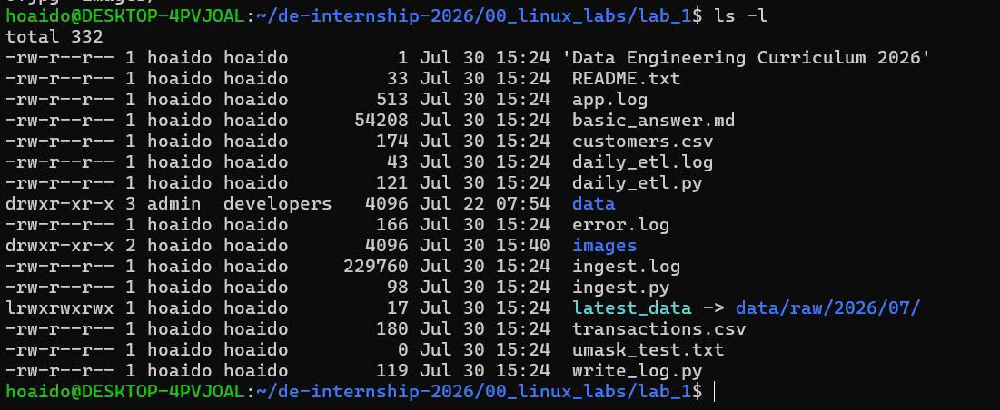
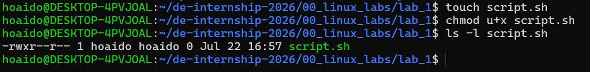
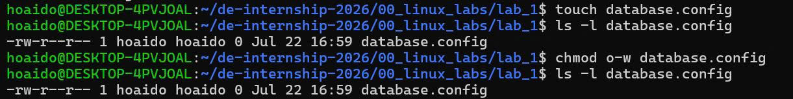
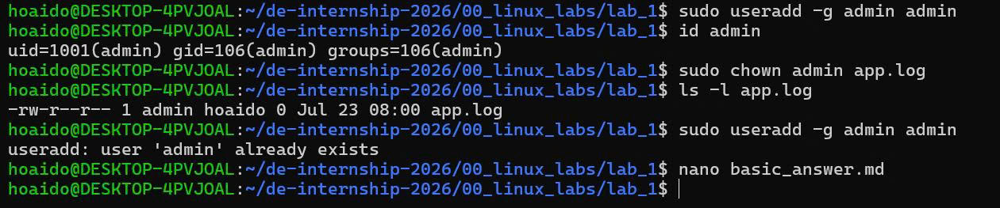
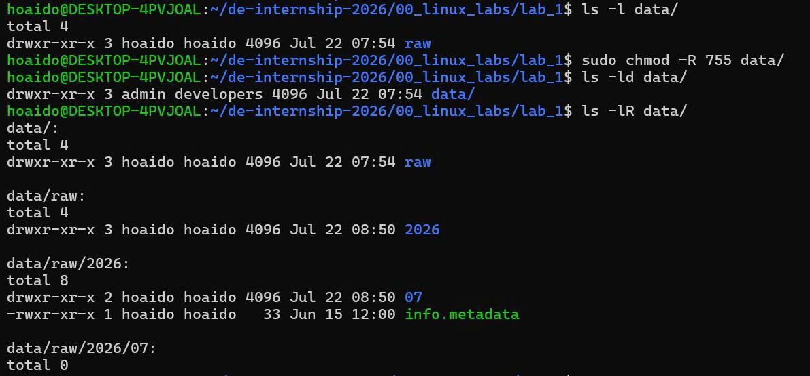
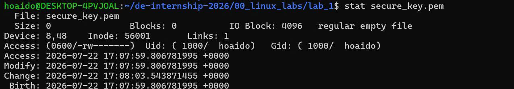

# LAB 2 - VIM

## Bài 2.1

### Đề bài

Sử dụng Vim để mở một tệp tin cấu hình mới tên là `database.ini`.

### Lệnh thực thi

```bash
vim database.ini
```

### Kết quả

Tệp `database.ini` đã được mở bằng trình soạn thảo Vim để bắt đầu soạn thảo.

### Ảnh minh chứng



---

## Bài 2.2

### Đề bài

Chuyển sang chế độ soạn thảo (Insert Mode), nhập vào nội dung kết nối database gồm `host`, `port`, `user`, sau đó quay về chế độ lệnh (Normal Mode) bằng phím `Esc`.

### Lệnh / phím tắt thực thi

```text
i
```

Nhập nội dung:

```ini
host=localhost
port=5432
user=hoaido
```

Sau đó nhấn:

```text
Esc
```

### Kết quả

Đã nhập thành công thông tin cấu hình database:

```ini
host=localhost
port=5432
user=hoaido
```

### Ảnh minh chứng



---

## Bài 2.3

### Đề bài

Lưu lại toàn bộ nội dung đã viết và thoát khỏi trình soạn thảo Vim để quay lại Terminal.

### Lệnh thực thi

Nhấn:

```text
Esc
```

Sau đó nhập:

```vim
:wq
```

và nhấn `Enter`.

### Kết quả

Tệp `database.ini` đã được lưu thành công và Vim đã thoát về Terminal.

Kiểm tra nội dung file bằng:

```bash
cat database.ini
```

Kết quả:

```ini
host=localhost
port=5432
user=hoaido
```

### Ảnh minh chứng



---
## Bài 2.4

### Đề bài

Mở lại `database.ini`, sửa một vài chỗ bất kỳ, sau đó thoát mà không lưu bằng `:q!`.

### Các bước thực hiện

Mở file:

```bash
vim database.ini
```

Sửa nội dung trong Vim, sau đó nhấn:

```text
Esc
```

Thoát mà không lưu:

```vim
:q!
```

### Kiểm tra kết quả

Sau khi thoát Vim, sử dụng:

```bash
cat database.ini
```

Kết quả:

```ini
host=localhost
port=5432
user=hoaido
```

### Kết luận

Các thay đổi đã thực hiện trong Vim không được lưu lại. Nội dung file `database.ini` vẫn giữ nguyên như trước khi chỉnh sửa. Điều này chứng minh lệnh `:q!` đã thoát Vim mà không lưu các thay đổi.

### Ảnh minh chứng


---
## Bài 2.5

### Đề bài

Viết một tệp cấu hình dài 50 dòng log giả lập, dùng `G` để nhảy xuống dòng cuối cùng, sau đó dùng `gg` để quay lại dòng đầu tiên.

### Lệnh thực thi

Mở file:

```bash
vim logs.txt
```

Trong Vim, nhấn `Esc` để đảm bảo đang ở Normal Mode.

Nhấn:

```text
G
```

để nhảy đến dòng cuối cùng của file.

Sau đó nhấn:

```text
gg
```

để quay lại dòng đầu tiên của file.

### Kết quả

Con trỏ đã được di chuyển thành công:

- `G`: Nhảy đến dòng cuối cùng (`Log line 50`).
- `gg`: Quay lại dòng đầu tiên (`Log line 1`).

### Ảnh minh chứng



---

## Bài 2.6

### Đề bài

Xóa nhanh đúng 3 dòng liên tục trong Vim bằng cách sử dụng lệnh `3dd` hoặc nhấn `dd` 3 lần.

### Lệnh thực thi

Mở file:

```bash
vim logs.txt
```

Đưa con trỏ đến dòng cần xóa, sau đó nhấn:

```text
3dd
```

Lệnh `3dd` sẽ xóa 3 dòng liên tục bắt đầu từ dòng hiện tại.

Sau đó lưu và thoát Vim:

```vim
:wq
```

### Kiểm tra kết quả

Sử dụng lệnh:

```bash
wc -l logs.txt
```

### Kết quả

Ban đầu file `logs.txt` có 50 dòng. Sau khi xóa 3 dòng liên tục, file còn:

```text
47 logs.txt
```

### Kết luận

Đã xóa thành công 3 dòng liên tục bằng lệnh `3dd`. File `logs.txt` còn 47 dòng.

### Ảnh minh chứng


---

## Bài 2.7

### Đề bài

Sao chép một dòng bất kỳ trong file log và dán dòng đó thành 5 lần liên tục bằng các lệnh `yy` và `p` trong Vim.

### Lệnh thực thi

Mở file:

```bash
vim logs.txt
```

Nhấn `Esc` để chuyển sang Normal Mode.

Di chuyển con trỏ đến một dòng có sẵn trong file, ví dụ:

```text
Log line 7
```

Sao chép dòng hiện tại bằng:

```text
yy
```

Sau đó dán dòng đã sao chép 5 lần bằng cách nhấn:

```text
p
p
p
p
p
```

Lưu và thoát Vim:

```vim
:wq
```

### Kiểm tra kết quả

Sử dụng lệnh:

```bash
grep -n "Log line 7" logs.txt
```

### Kết quả

Kết quả kiểm tra cho thấy dòng `Log line 7` xuất hiện nhiều lần trong file:

```text
7:Log line 7
8:Log line 7
10:Log line 7
12:Log line 7
15:Log line 7
17:Log line 7
```

### Kết luận

Đã thực hiện thành công thao tác sao chép một dòng có sẵn bằng lệnh `yy` và dán dòng đó nhiều lần bằng lệnh `p` trong Vim.

### Ảnh minh chứng



---
## Bài 2.8

### Đề bài

Tìm kiếm từ khóa `port` trong tệp cấu hình và nhảy qua các kết quả trùng khớp tiếp theo xuôi chiều và ngược chiều bằng `/port`, `n` và `N`.

### Lệnh thực thi

Mở file:

```bash
vim database.ini
```

Đảm bảo đang ở Normal Mode bằng cách nhấn:

```text
Esc
```

Tìm kiếm từ khóa `port`:

```text
/port
```

Nhấn `Enter` để thực hiện tìm kiếm.

Sau đó nhấn:

```text
n
```

để chuyển đến kết quả tìm kiếm tiếp theo theo chiều xuôi.

Nhấn:

```text
N
```

để quay lại kết quả tìm kiếm trước đó theo chiều ngược lại.

### Các thao tác đã thực hiện

```text
Esc
/port
Enter
n
N
```

### Kết quả

Vim đã thực hiện tìm kiếm từ khóa `port` trong file `database.ini`. Các phím `n` và `N` được sử dụng để di chuyển lần lượt đến kết quả tiếp theo và kết quả trước đó.

Nội dung file tại thời điểm thực hiện:

```ini
host=localhost
port=542
user=hoaido
```

### Kết luận

Đã thực hiện thành công thao tác tìm kiếm từ khóa `port` bằng `/port` và sử dụng `n`, `N` để điều hướng giữa các kết quả tìm kiếm trong Vim.

### Ảnh minh chứng


---
## Bài 2.9 [Khó]

### Đề bài

Sử dụng phím tắt để hoàn tác (`Undo - u`) một thao tác vừa xóa nhầm dòng, sau đó làm ngược lại khôi phục (`Redo - Ctrl + R`).

### Lệnh thực thi

Mở file:

```bash
vim logs.txt
```

Đảm bảo đang ở Normal Mode:

```text
Esc
```

Xóa dòng hiện tại:

```text
dd
```

Sau khi thực hiện, Vim hiển thị:

```text
1 line less
```

Điều này cho biết một dòng đã được xóa.

### Thực hiện Undo

Nhấn:

```text
u
```

Lệnh `u` sẽ hoàn tác thao tác vừa thực hiện và khôi phục lại dòng vừa bị xóa.

### Thực hiện Redo

Nhấn:

```text
Ctrl + R
```

Lệnh `Ctrl + R` sẽ thực hiện lại thao tác đã được hoàn tác, tức là dòng vừa khôi phục sẽ lại bị xóa.

### Các thao tác đã thực hiện

```text
Esc
dd
u
Ctrl + R
```

### Thoát không lưu

Để không làm thay đổi file `logs.txt` sau khi thực hành:

```vim
:q!
```

### Kết quả

- `dd`: Xóa một dòng.
- `u`: Undo, khôi phục dòng vừa xóa.
- `Ctrl + R`: Redo, thực hiện lại thao tác xóa.
- `:q!`: Thoát Vim mà không lưu thay đổi.

### Kết luận

Đã thực hiện thành công thao tác **Undo** và **Redo** trong Vim bằng phím `u` và `Ctrl + R`.

### Ảnh minh chứng



---
## Bài 2.10

### Đề bài

Thực hiện thay thế tự động (Find and Replace) tất cả các từ khóa `localhost` thành địa chỉ IP `192.168.1.15` trên toàn bộ tệp tin bằng một câu lệnh duy nhất ở chế độ Command-line.

### Lệnh thực thi

Mở file:

```bash
vim database.ini
```

Trong Vim, nhấn `Esc`, sau đó nhập lệnh:

```vim
:%s/localhost/192.168.1.15/g
```

Nhấn `Enter` để thực hiện thay thế.

Sau đó lưu file:

```vim
:wq
```

### Kiểm tra kết quả

Sử dụng lệnh:

```bash
cat database.ini
```

Kết quả:

```ini
host=192.168.1.15
port=542
user=hoaido
```

### Kết quả

Từ khóa:

```text
localhost
```

đã được thay thế thành:

```text
192.168.1.15
```

trên toàn bộ file `database.ini`.

### Kết luận

Đã thực hiện thành công thao tác Find and Replace trên toàn bộ tệp `database.ini` bằng lệnh:

```vim
:%s/localhost/192.168.1.15/g
```

### Ảnh minh chứng


---
